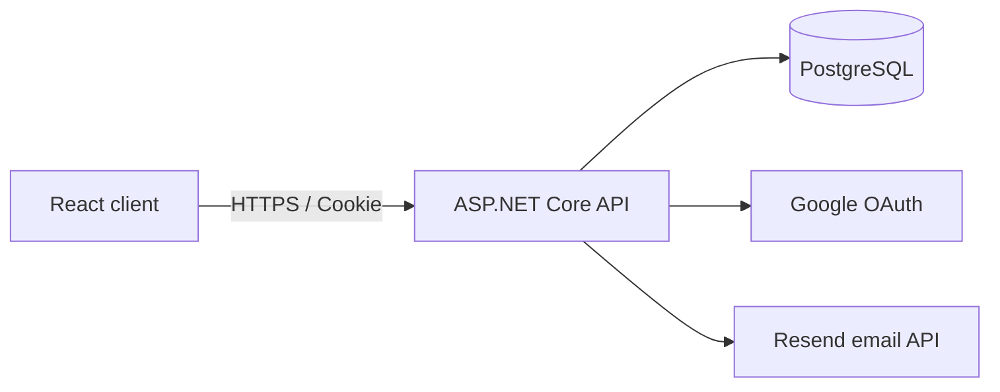

<p align="center">
  
</p>

<h1 align="center">Applyline</h1>

<p align="center">
  A focused workspace for tracking job applications, interviews, assessments, and follow-ups.
</p>

<p align="center">
  <a href="https://applyline.app">Live application</a>
  ·
  <a href="https://applyline.app/privacy">Privacy</a>
  ·
  <a href="https://applyline.app/terms">Terms</a>
</p>

## About

Applyline helps job seekers keep their search organized without turning it into another complicated project. It combines application tracking, status history, interview rounds, scheduled events, and account management in one responsive workspace.

The application is built as a React single-page application backed by an ASP.NET Core API and PostgreSQL. The production Docker image serves both the compiled frontend and API from the same origin.

## Features

- Track applications from **Applied** through **Accepted**, **Rejected**, or **Withdrawn**.
- Separate active opportunities from closed outcomes without deleting history.
- Search, filter, sort, and paginate the application list.
- Record interview rounds and assessment stages.
- Schedule interviews, assessments, and follow-ups in a monthly calendar.
- Review a complete application status timeline and undo recent status changes.
- Sign in with email and password or Google.
- Keep a session active for seven days with **Remember me**.
- Reset forgotten passwords through Resend email delivery.
- Manage display name, password, and sign-in methods from Account settings.
- Use the tracker on desktop and mobile, including iPhone Safari.
- Preserve authentication encryption keys in PostgreSQL across deployments.

## Technology

| Layer | Technology |
| --- | --- |
| Frontend | React 19, TypeScript, Vite, React Router, Ant Design, Sass |
| Backend | ASP.NET Core 10, ASP.NET Core Identity, Entity Framework Core |
| Database | PostgreSQL 18 |
| Authentication | Secure cookie authentication, Google OAuth |
| Email | Resend |
| Production | Docker, Render, Cloudflare |

## Architecture



In production, ASP.NET Core serves the Vite build from `wwwroot`. API requests use the `/api` prefix, and client-side routes fall back to `index.html`.

## Project structure

```text
.
├── backend/JobTracker.Api/   ASP.NET Core API, Identity, EF Core, migrations
├── frontend/                 React and TypeScript client
├── compose.yaml              Local production-style app and PostgreSQL stack
├── Dockerfile                Multi-stage frontend and backend build
└── .env.example              Docker Compose environment template
```

## Requirements

For the Docker setup:

- Docker Desktop with Docker Compose

For native development:

- Node.js 22 or later
- .NET SDK 10
- PostgreSQL 18
- `dotnet-ef` 10 for applying migrations locally

## Quick start with Docker

1. Clone the repository:

   ```bash
   git clone https://github.com/Limwalnut/job-tracker.git
   cd job-tracker
   ```

2. Create the local environment file:

   ```bash
   cp .env.example .env
   ```

3. Replace `POSTGRES_PASSWORD` in `.env` with a long random password. Google sign-in and Resend variables can remain empty when those integrations are not needed.

4. Build and start the application:

   ```bash
   docker compose up --build
   ```

5. Open [http://localhost:10000](http://localhost:10000).

The PostgreSQL port is exposed only on `127.0.0.1:5432`. Database data is retained in the `postgres18_data` Docker volume.

Stop the stack with:

```bash
docker compose down
```

Start it again with:

```bash
docker compose up -d
```

## Native development

Start PostgreSQL only:

```bash
docker compose up -d db
```

Configure the backend connection string with .NET user secrets:

```bash
dotnet user-secrets set \
  "ConnectionStrings:DefaultConnection" \
  "Host=localhost;Port=5432;Database=jobtracker;Username=jobtracker;Password=YOUR_PASSWORD" \
  --project backend/JobTracker.Api
```

Apply the database migrations:

```bash
dotnet ef database update --project backend/JobTracker.Api
```

Run the API at [http://localhost:5059](http://localhost:5059):

```bash
dotnet run --project backend/JobTracker.Api --launch-profile http
```

In another terminal, run the frontend:

```bash
cd frontend
npm ci
npm run dev
```

Vite normally opens the frontend at [http://localhost:5173](http://localhost:5173) and proxies `/api` requests to port `5059`.

## Configuration

Use environment variables in production. ASP.NET Core maps double underscores to nested configuration keys.

| Variable | Required | Purpose |
| --- | --- | --- |
| `ConnectionStrings__DefaultConnection` | Yes | PostgreSQL connection string |
| `Authentication__Google__ClientId` | For Google sign-in | Google OAuth client ID |
| `Authentication__Google__ClientSecret` | For Google sign-in | Google OAuth client secret |
| `Authentication__FrontendBaseUrl` | Recommended | Public frontend URL used after Google authentication |
| `Email__ApiKey` | For email flows | Resend API key |
| `Email__FromAddress` | For email flows | Verified sender, for example `no-reply@mail.applyline.app` |
| `Email__FromName` | No | Sender name; defaults to `Applyline` |
| `Email__FrontendBaseUrl` | For password reset | Public URL used to build reset links |

Never commit `.env`, production connection strings, OAuth secrets, or Resend API keys.

### Google OAuth

Create a Web application OAuth client in Google Cloud and add the appropriate authorized redirect URI:

```text
http://localhost:5059/signin-google
https://applyline.app/signin-google
```

Add the client ID and secret to user secrets for local development or to the hosting provider's environment variables in production.

### Resend

Verify the sending domain in Resend, add the provided DNS records, and configure `Email__ApiKey` and `Email__FromAddress`. Password reset links expire after one hour.

## Database migrations

Create a migration after changing the EF Core model:

```bash
dotnet ef migrations add MigrationName --project backend/JobTracker.Api
```

Apply it locally:

```bash
dotnet ef database update --project backend/JobTracker.Api
```

In production, the API automatically runs pending migrations during startup. Review generated migration files before deployment and back up production data before destructive schema changes.

## Deploying to Render

1. Create a Render PostgreSQL database.
2. Create a Web Service from this repository.
3. Select **Docker** as the runtime and deploy the `main` branch.
4. Set the health check path to `/health`.
5. Add the production environment variables listed above.
6. Deploy the service and confirm the migration and health-check logs complete successfully.
7. Add the custom domain in Render, then point its DNS records to Render. Cloudflare can provide DNS management, proxying, TLS, and traffic analytics.

The Docker image listens on port `10000`. Pending Entity Framework migrations run before the application begins serving requests.

## Validation

Run the frontend checks:

```bash
cd frontend
npm run lint
npm run build
```

Build the backend:

```bash
dotnet build backend/JobTracker.Api/JobTracker.Api.csproj --no-restore
```

Build the complete production image:

```bash
docker build -t applyline:local .
```

## Security notes

- Authentication uses `HttpOnly` cookies and requires secure cookies in production.
- Authentication cookies expire after seven days and use sliding expiration.
- Identity endpoints are rate limited.
- ASP.NET Core Data Protection keys are stored in PostgreSQL so sessions survive deployments.
- Private application, account, authentication, and API routes return `noindex, nofollow` headers.
- User-owned application and event queries are scoped to the authenticated user.

